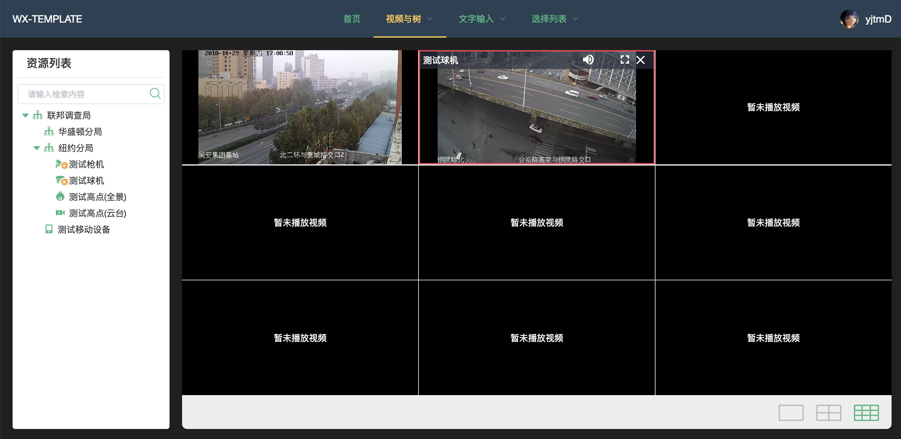

# wx-template

> 常用组件库

## Build Setup

``` bash
# install dependencies
npm install

# serve with hot reload at localhost:8080
npm start

# build for production with minification
npm run build
```

## 项目目录

```
├── api                  // 模拟数据
├── build                // webpack,expressRouter等配置
├── config               // 开发生产环境配置
├── src                 
│   ├── assets
│       ├── font         // iconfont
│       ├── images       // 公共图片
│       ├── scss         // 公共样式
│   ├── axios            // axios配置文件
│   ├── components       // 组件
│   ├── pages            // 页面
│   ├── router           // vue-router配置
│   ├── vuex             // vuex配置
│   ├── App.vue         
│   ├── main.js
├── static
│   ├── config           // 系统配置文件
│   ├── plugin           // 插件
├── .eslintrc.js
├── index.html
├── package.json
├── README.md        

```

## 插件截图

> 基于Laydate5.0.9 改写的时间选择，全部点选


> 九宫格视频与树联动操作(可用于云台控制)


